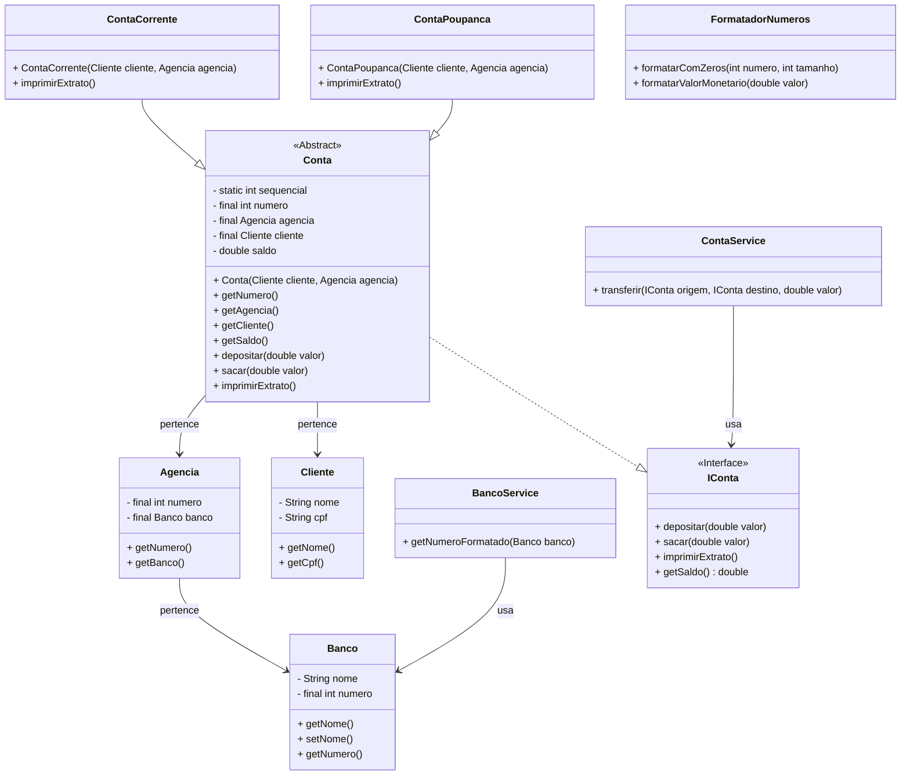

## Desafio - Banco Digital

O objetivo deste projeto prático hands-on é reforçar o conhecimento em Programação Orientada a Objetos (POO) em Java, através da implementação de um sistema de banco digital.
Serão trabalhados, na prática, os quatro pilares da POO:

- Abstração
- Encapsulamento
- Herança
- Polimorfismo

 

### Descrição

Este repositório contém um projeto de referência desenvolvido em Java, modelando um banco digital com:
- Criação de **bancos**, **agências**, **clientes** e **contas**
- Dois tipos de conta: **Conta Corrente** e **Conta Poupança**, ambas herdando de uma classe abstrata `Conta`
- Interface `IConta` para garantir um contrato comum às contas
- Serviços para transferência entre contas
- Utilitários para formatação de números e valores monetários
- Exibição de extrato formatado (ex.: `R$ 1.234,56`)

 

### Diagrama UML

